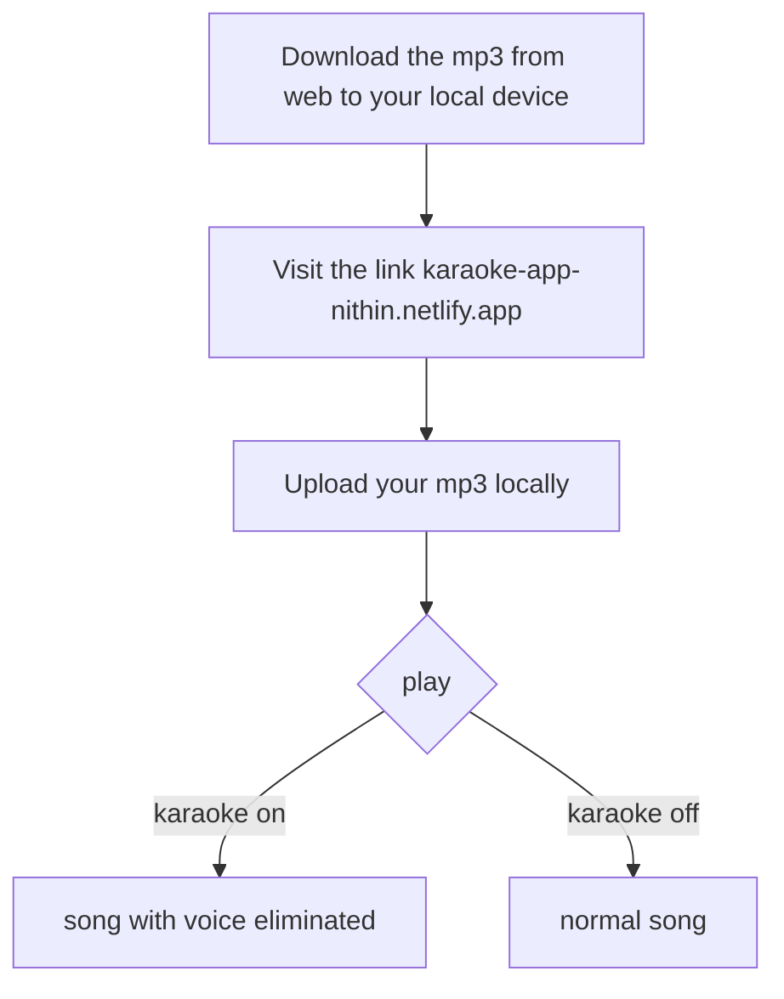
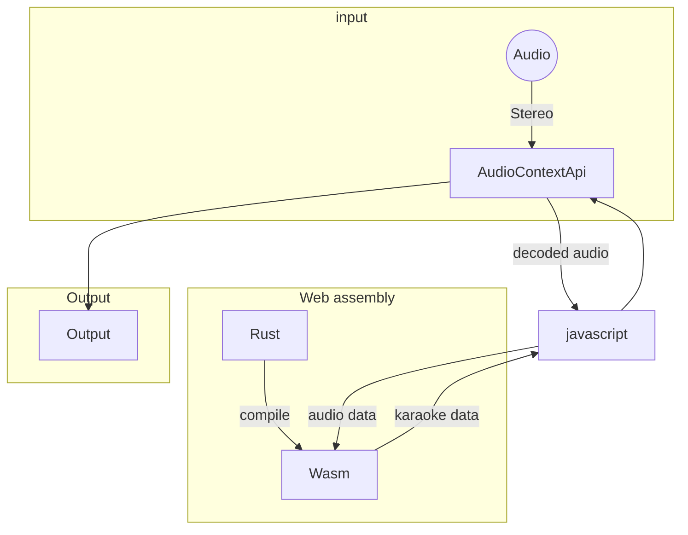
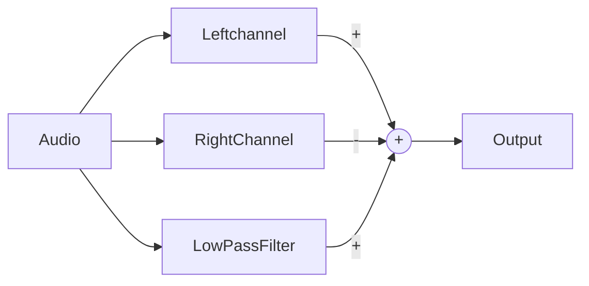

<h1 align="center">Karaoke</h1>

<h4 align="center"> Unable to find a karaoke track for your favourite songs 🎵 ? No worries I got a solution! 🤝 </h4>
 <h3 align="center" >web-app link: <a href="https://karaoke-app-nithin.netlify.app/" target="_blank" >https://karaoke-app-nithin.netlify.app/</a> </h3>

### A _karaoke_ is a music where a singer/singers can sing along with consists of just the instrumental track and the beats track.

In order to get a karaoke track we should contact a musician to make for the specific song. But in this solution you can download the normal song in mp3 format which is available in various sites and the job is basically done, just visit the link in your device 📱 / 💻 and upload the song. You can toggle between karaoke mode and enjoy the song at your ease.

<h3>  Newer songs ✔️  </h3>
<h3> Mobile Friendly ✔️ </h3>
<h3> lightweight ✔️ </h3>
<h3>  Too old songs ✖️  </h3>
 <h3>  Songs with excessive chorous  ❓   </h3>
 

## About the application

This app uses `javascript` + `Rust\Wasm`

- Rust/Wasm
  - To build up webassembly
  - Faster then javascript
- Javascript
  - Interracting with Wasm
  - Custom audio player
- AudioContext Api
  - Built in api for most of the browser
  - Interract with audio
  - Decoding the audio
  <h2 align="center"> Karaoke-web-app</h2>

# Methodology

A modern song is usually a stereo mix i.e it consist of left channel + right channel.

---

**Note**
what is stereo? visit the link : https://www.youtube.com/watch?v=uItVI2zYnPo

---

